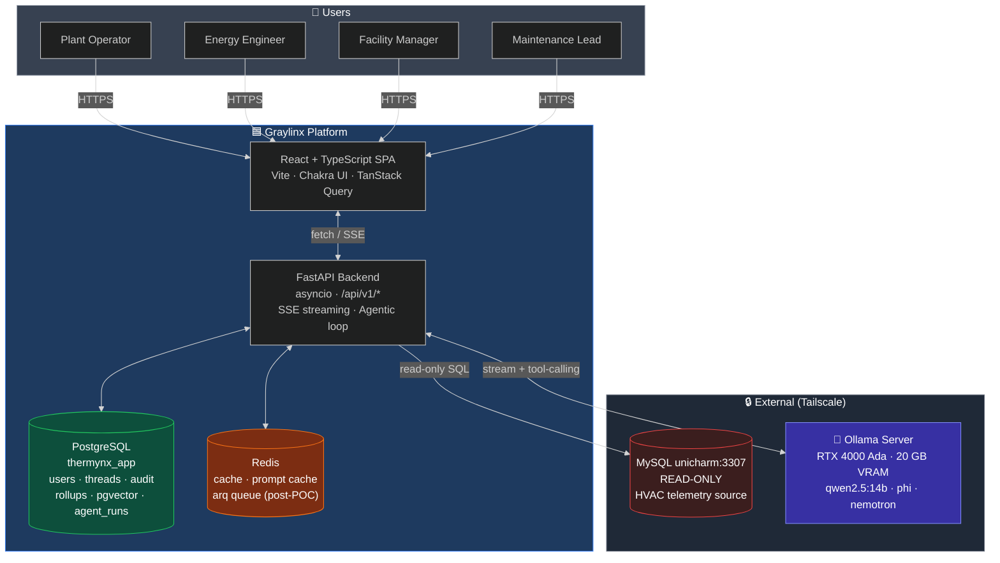
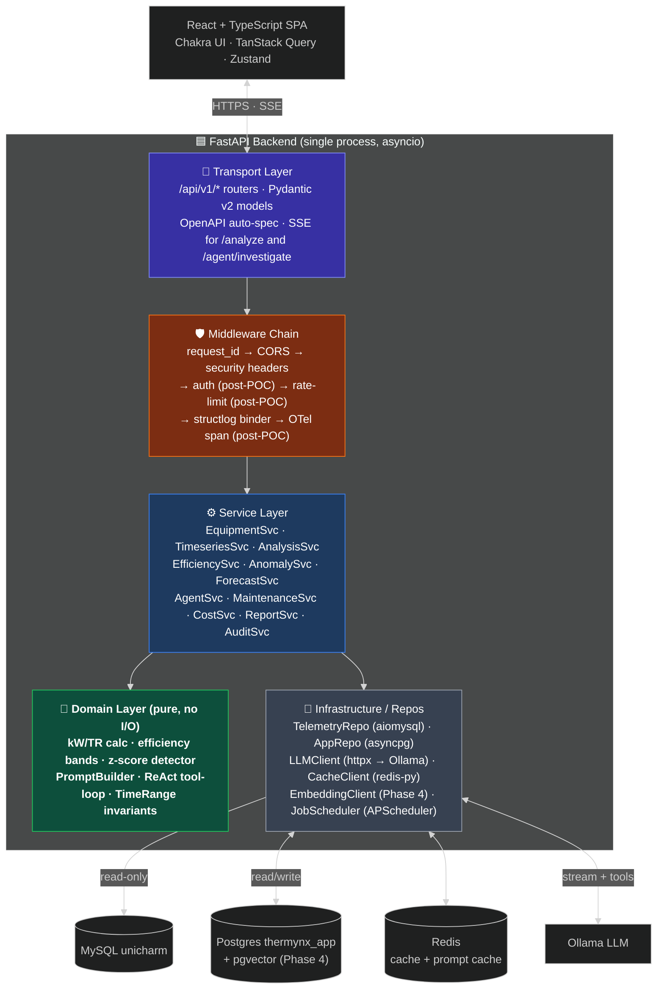
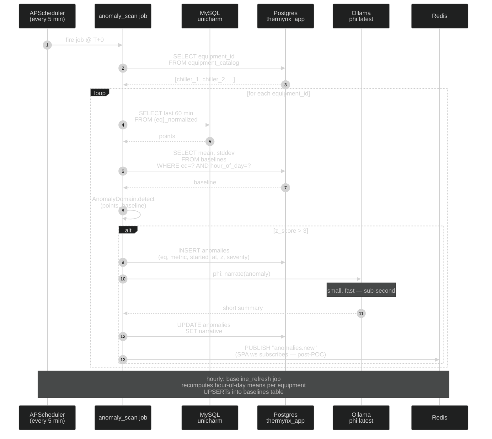
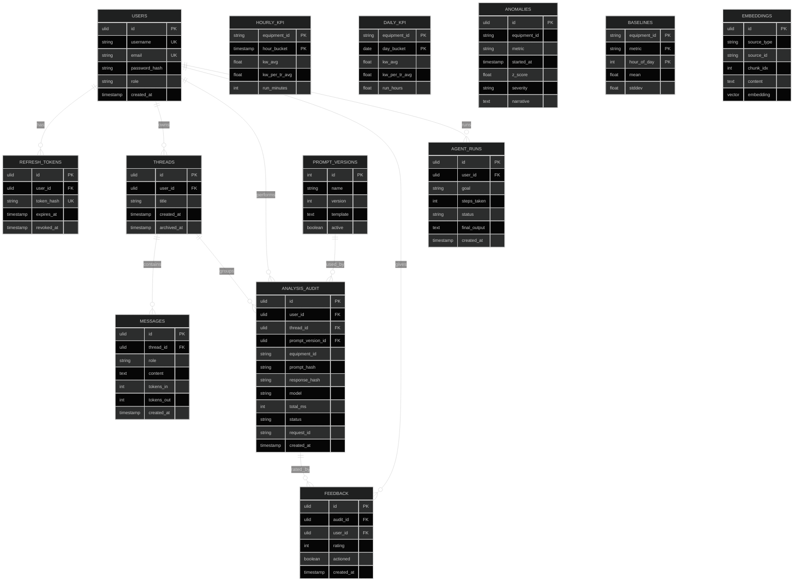
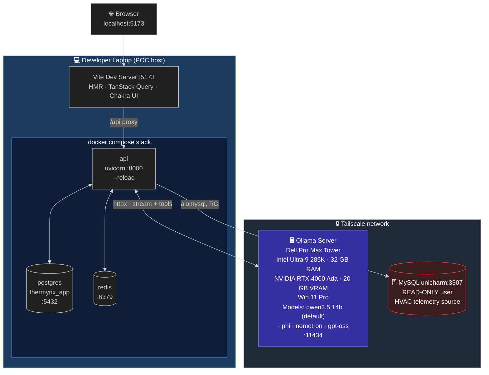

# Graylinx — Architecture Reference

Visual architecture and system flows for Graylinx. Every diagram below is **rendered live** on GitHub (and any Mermaid-aware viewer). Source `.mmd` files live in [`diagrams/`](./diagrams/) — see [diagrams/README.md](./diagrams/README.md) for HD export instructions.

> **Reading order:** §1 system context → §2 backend layers → §3–§5 sequence flows → §6 ERD → §7 deployment → §8 data flow.

---

## 1. System Context (C4 — Level 1)

Who uses Graylinx, what Graylinx is, and what it talks to. The two external systems (MySQL `unicharm` and the Ollama server) are reached over Tailscale.



---

## 2. Backend Container View (C4 — Level 2)

The FastAPI process internally as a five-layer stack. Dependencies point **inward**: domain has zero I/O, services orchestrate, infra is replaceable.



---

## 3. UC1 — Live AI Analyzer flow

End-to-end of the hero use case: the user picks chiller_1, last 24 hours, asks "explain efficiency". Three coloured bands group the cache lookup, the data fetch, and the AI streaming step.

```mermaid
%%{init: {'theme': 'dark', 'themeVariables': {'fontSize': '14px'}}}%%
sequenceDiagram
    autonumber
    actor User
    participant SPA as React SPA
    participant API as FastAPI
    participant Cache as Redis
    participant MySQL as MySQL<br/>unicharm
    participant PG as Postgres<br/>thermynx_app
    participant Ollama as Ollama<br/>qwen2.5:14b

    User->>SPA: pick chiller_1, range=24h<br/>ask "explain efficiency"

    rect rgb(30, 58, 95)
        Note over SPA,API: Equipment catalog
        SPA->>API: GET /api/v1/equipment
        API->>Cache: L2 lookup
        Cache-->>API: MISS
        API->>MySQL: SELECT FROM information_schema
        MySQL-->>API: equipment list
        API->>Cache: SET (5m TTL)
        API-->>SPA: 200 [equipment]
    end

    rect rgb(13, 79, 60)
        Note over SPA,MySQL: Timeseries fetch
        SPA->>API: GET /timeseries?range=24h&res=5m
        API->>Cache: L3 Redis lookup
        Cache-->>API: MISS
        API->>MySQL: SELECT * FROM chiller_1_normalized<br/>WHERE slot_time BETWEEN ...
        MySQL-->>API: ~288 points
        API->>Cache: SET (60s TTL)
        API-->>SPA: 200 [points]
        SPA->>SPA: render Recharts
    end

    rect rgb(55, 48, 163)
        Note over SPA,Ollama: AI Analysis (streaming)
        SPA->>API: POST /api/v1/analyze {eq, range, q}
        API->>PG: INSERT analysis_audit<br/>(status=streaming)
        API->>API: PromptBuilder.build(eq, stats, q)
        API->>Cache: L4 prompt cache check
        Cache-->>API: MISS
        API->>Ollama: POST /api/generate (stream=true)

        loop for each token chunk
            Ollama-->>API: chunk (line-delimited JSON)
            API-->>SPA: SSE data: {type:token, content}
            SPA->>SPA: append + re-render markdown
        end

        Ollama-->>API: done=true
        API->>Cache: SET prompt cache (1h)
        API->>PG: UPDATE audit (status=ok,<br/>response_hash, tokens, total_ms)
        API-->>SPA: SSE data: {type:done}
        SPA-->>User: rendered investigation
    end
```



---

## 4. Agentic Investigator (ReAct loop)

The Phase 3 "AI Agent" sidebar feature. User states a high-level goal; the agent autonomously decides which tools to call, iterates, and synthesizes a final report. Each tool result streams back to the SPA as it happens, so the user sees the agent's reasoning live.

```mermaid
%%{init: {'theme': 'dark', 'themeVariables': {'fontSize': '14px'}}}%%
sequenceDiagram
    autonumber
    actor User
    participant SPA as React SPA<br/>(AI Agent page)
    participant API as FastAPI<br/>AgentService
    participant Tools as Tool Registry<br/>(get_timeseries,<br/>compute_efficiency,<br/>detect_anomalies, ...)
    participant Ollama as Ollama<br/>qwen2.5:14b<br/>(tool-calling)
    participant PG as Postgres<br/>agent_runs

    User->>SPA: "investigate chiller_1's<br/>recent performance"
    SPA->>API: POST /api/v1/agent/investigate<br/>{goal, max_steps:8}
    API->>PG: INSERT agent_runs<br/>(status=running, goal)

    rect rgb(55, 48, 163)
        Note over API,Ollama: ReAct loop — step 1
        API->>Ollama: chat(messages, tools=[schemas])
        Ollama-->>API: {tool_call: compute_efficiency,<br/>args:{eq:chiller_1, range:24h}}
        API-->>SPA: SSE thought + tool_call
        API->>Tools: execute(compute_efficiency, args)
        Tools-->>API: {band:poor, kW/TR:0.82, drivers:[...]}
        API-->>SPA: SSE tool_result
        API->>API: append result to messages
    end

    rect rgb(13, 79, 60)
        Note over API,Ollama: ReAct loop — step 2
        API->>Ollama: chat(messages, tools)
        Ollama-->>API: {tool_call: detect_anomalies, args}
        API-->>SPA: SSE tool_call
        API->>Tools: execute(detect_anomalies, args)
        Tools-->>API: [anomaly: ΔT collapsed at 14:32]
        API-->>SPA: SSE tool_result
    end

    rect rgb(124, 45, 18)
        Note over API,Ollama: ReAct loop — step 3
        API->>Ollama: chat(messages, tools)
        Ollama-->>API: {tool_call: compare_equipment,<br/>args:{a:chiller_1, b:chiller_2}}
        API->>Tools: execute(compare_equipment)
        Tools-->>API: {chiller_2 is 0.18 kW/TR better}
        API-->>SPA: SSE tool_result
    end

    Note over API,Ollama: LLM decides it has enough info

    Ollama-->>API: {final: "# Investigation: chiller_1<br/>**Findings:** poor efficiency band,<br/>ΔT collapse at 14:32, ..."}
    API->>PG: UPDATE agent_runs<br/>(status=ok, steps:3, final_output)
    API-->>SPA: SSE final
    SPA-->>User: rendered investigation report<br/>+ tool-call trace timeline
```



---

## 5. Anomaly background scan

Runs every 5 minutes via APScheduler in-process (POC) — moves to arq workers post-POC. Scans every equipment, compares against the hour-of-day baseline, persists hits, and asks `phi:latest` for a one-line narrative.



---

## 6. Database ERD — `thermynx_app`

The Postgres schema Graylinx owns. `unicharm` MySQL is read-only and not shown here. ULIDs everywhere for time-sortable IDs. `embeddings` table appears in Phase 4.



---

## 7. POC Deployment Topology

POC runs on **one developer laptop** plus the Tailscale-attached Ollama server. No nginx, no TLS, no registry — just `make dev`.



---

## 8. End-to-end Data Flow

How a chiller reading travels from the BMS / PLC all the way to a rendered LLM markdown answer (with optional RAG retrieval in Phase 4).

```mermaid
%%{init: {'theme': 'dark', 'themeVariables': {'fontSize': '14px'}}}%%
flowchart LR
    BMS["🏭 Unicharm BMS / PLCs<br/>(upstream — not ours)"]
    Raw["MySQL raw tables<br/>*_metric · *_om_p"]
    Norm["MySQL normalized<br/>*_normalized<br/>slot_time bucketed"]

    BMS -->|"telemetry ingest"| Raw
    Raw -->|"normalization<br/>Graylinx ingestion"| Norm

    Norm -->|"GET /timeseries<br/>direct read · cached 60s"| API
    Norm -->|"hourly arq job"| Rollup["Postgres<br/>hourly_kpi · daily_kpi"]
    Norm -->|"every 5 min APScheduler"| AnomDet["Anomaly Detector<br/>z-score vs baselines"]
    AnomDet --> Anom["Postgres<br/>anomalies"]

    API["FastAPI<br/>Service Layer"] -->|stats + context| PromptBuild["Prompt Builder<br/>(domain, pure)"]
    PromptBuild -->|chat / tool-calling| Ollama["Ollama<br/>qwen2.5:14b"]
    Ollama -->|SSE chunks| API
    API -->|audit + cache| PG[("Postgres<br/>analysis_audit<br/>prompt_cache · agent_runs")]
    API -->|streamed markdown| SPA["React SPA"]

    Rollup -.->|"snappy dashboards"| API
    Anom -.->|"alerts feed"| API

    Manuals["📄 Equipment manuals<br/>ASHRAE guides<br/>(Phase 4)"] -->|"ingest · chunk · embed<br/>nomic-embed-text"| Embed[("Postgres<br/>embeddings (pgvector)")]
    Embed -.->|"retrieve top-k chunks"| PromptBuild

    classDef bms fill:#3b1e1e,stroke:#ef4444,color:#fff
    classDef raw fill:#3b1e1e,stroke:#ef4444,color:#fff
    classDef norm fill:#0d4f3c,stroke:#22c55e,color:#fff
    classDef rollup fill:#0d4f3c,stroke:#22c55e,color:#fff
    classDef anom fill:#7c2d12,stroke:#f97316,color:#fff
    classDef ollama fill:#3730a3,stroke:#818cf8,color:#fff
    classDef pg fill:#1e3a5f,stroke:#3b82f6,color:#fff

    class BMS bms
    class Raw raw
    class Norm norm
    class Rollup rollup
    class Anom anom
    class AnomDet anom
    class Ollama ollama
    class PG pg
    class Embed pg
```



---

## Exporting these to slide-deck PNGs

For Keynote / PowerPoint / Google Slides, see [`diagrams/README.md`](./diagrams/README.md). One-liner:

```bash
cd docs/diagrams
npm install -g @mermaid-js/mermaid-cli
for f in *.mmd; do
  mmdc -i "$f" -o "${f%.mmd}.png" -w 3840 -H 2160 -b "#0f172a"
done
```

Edit the `.mmd` source files when the architecture changes — never edit rendered images directly.
