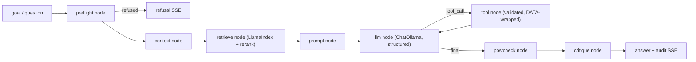
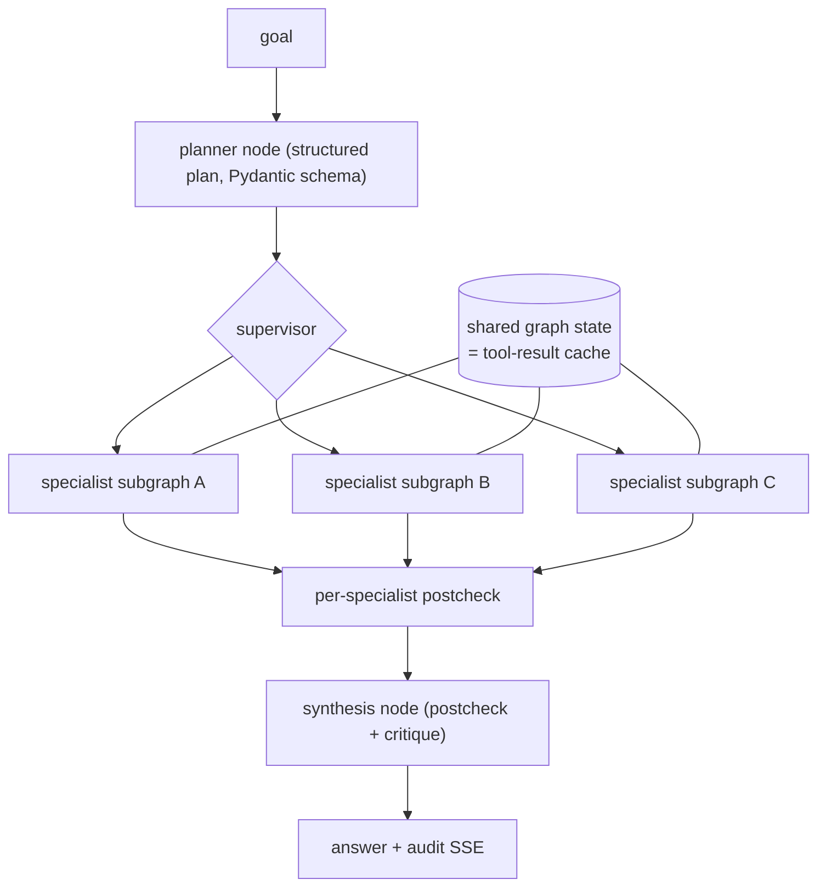
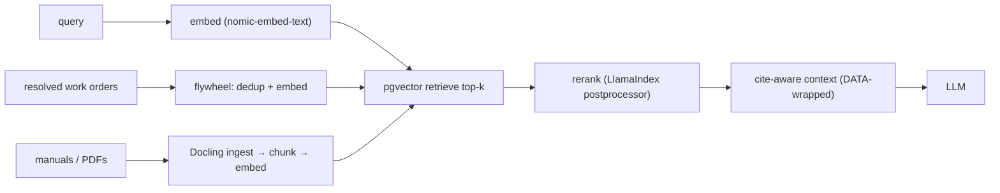

# Agentic AI — Target Architecture (Framework Stack)

> Target-state design for the framework rewrite. Plan: [FRAMEWORK_REWRITE_PLAN.md](./FRAMEWORK_REWRITE_PLAN.md).
> Decision: [ADR-0002](../architecture/decisions/0002-adopt-agentic-framework-stack.md).
> Current-state (pre-rewrite) reference: [AI_ARCHITECTURE_REFERENCE.md](../architecture/AI_ARCHITECTURE_REFERENCE.md).

## Stack (open-source, on-prem)

| Layer | Framework | Role |
|-------|-----------|------|
| Orchestration | **LangGraph** | StateGraph for ReAct + multi-agent; conditional edges; streaming; checkpoint memory |
| LLM interface | **langchain-ollama** `ChatOllama` | one instance per task-model (per-task routing) |
| Structured output | **Pydantic** + `.with_structured_output()` | planner / critique / tool-args |
| RAG | **LlamaIndex** (+ **Docling** ingest) | retrieve / rerank over the existing **pgvector** |
| Tracing | **Langfuse** (self-hosted) | span per node + tool |
| Eval | **RAGAS + DeepEval** + golden suite | regression gate |
| Serving / store | **Ollama** · **pgvector** · **Redis** (LangGraph checkpointer) | unchanged |

## Design principles (carried from ADR-0001, preserved in ADR-0002)

LLM is least-trusted · deterministic guards as graph nodes · per-task non-Chinese models · schema-first
I/O · stream everything · fail-soft · on-prem, zero egress. **No cloud** (Langfuse self-hosted, never
LangSmith; no OpenAI/Anthropic APIs).

## Surface flow (single-agent ReAct as a LangGraph StateGraph)

Guards (`preflight`, `postcheck`, `critique`) are **explicit nodes** — not hidden in a framework
executor. Conditional edges replace the old flat loop (e.g. anomaly severity → root-cause path).
Streaming maps to the existing SSE frame contract (token / tool_call / tool_result / audit / done).

## Human-in-the-loop & memory

- **Interrupts:** sensitive/ambiguous steps call LangGraph `interrupt()` — the graph pauses, the
  operator approves / edits / rejects via the UI, then it resumes. Generalizes the work-order
  approval gate; the read-only guarantee is enforced here.
- **Memory:** a LangGraph **checkpointer** (Postgres/Redis) persists per-thread state and makes runs
  resumable across restarts. Long-term cross-session recall is served by the **pgvector knowledge
  flywheel** — no separate memory store.

## Multi-agent (LangGraph supervisor)

Specialists are ReAct subgraphs; shared graph state replaces the run-scoped tool cache; failed
specialists carry an explicit "do not infer" marker into synthesis.

## RAG pipeline (LlamaIndex over pgvector)

## Component → file map (target)

| Component | Where (target) | Notes |
|-----------|----------------|-------|
| Graph app + nodes | `app/ai/graph/` (new) | StateGraph definitions; nodes wrap existing logic |
| Guards | reuse [preflight.py](../../backend/app/ai/preflight.py) · [postcheck.py](../../backend/app/ai/postcheck.py) · [critique.py](../../backend/app/ai/critique.py) | wrapped as nodes |
| LLM router | `app/llm/` | `ChatOllama` per task-model; keeps [config.py](../../backend/app/config.py) routing |
| Structured output | Pydantic schemas + `with_structured_output` | retires [json_utils.py](../../backend/app/ai/json_utils.py) to fallback |
| RAG | LlamaIndex `PGVectorStore` over existing `embeddings` | reuse [rag.py](../../backend/app/ai/rag.py) logic, port ingest |
| Tools | LangChain `@tool` ports of [tools.py](../../backend/app/ai/tools.py) | keep validation, allow-list, DATA-wrap, WO loop |
| Tracing | Langfuse callback on the graph | spans per node/tool |
| Eval | [tests/eval/](../../backend/tests/eval/) + RAGAS/DeepEval | gate |
| Facade | [pipeline.py](../../backend/app/ai/pipeline.py) | endpoints unchanged during cutover |

## What does NOT change

Per-task routing · non-Chinese models · preflight/postcheck/critique guards · DATA-wrapping · SSE
contract · audit-trail tables (`analysis_audit`, `agent_runs`) · pgvector · Ollama · on-prem/zero-egress.

> **Vector store decision (locked):** stays **Postgres + pgvector** — **no separate vector DB**
> (Qdrant/Milvus) for now. LlamaIndex uses `PGVectorStore` over the existing `embeddings` table.
> Revisit only above ~10M vectors.
