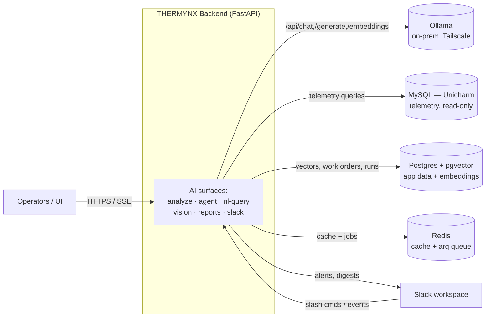
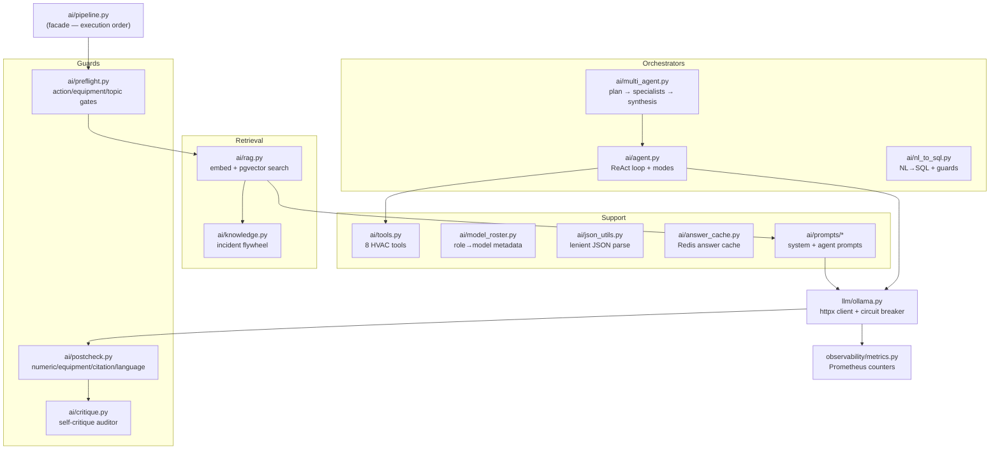
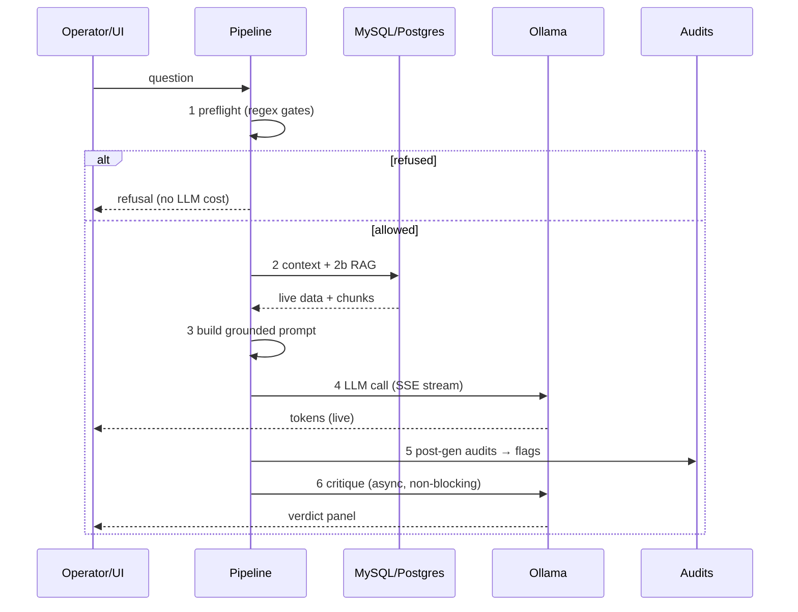
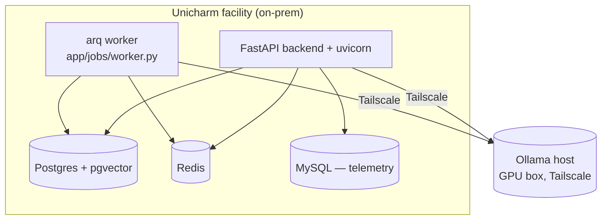

# THERMYNX AI Backend — Architecture Reference

> **Format:** This document follows the [arc42](https://arc42.org) architecture template.
> **Scope:** The AI/LLM subsystem of the Graylinx HVAC AI Operations Intelligence Platform
> (product name **THERMYNX**), deployed on-premise at the Unicharm facility.
> **Status:** POC closeout. Last reconciled against code: see `git log` for this file.

Related docs: [TECH_STACK.md](./TECH_STACK.md) · [Agent & Tools Reference](../reference/ai/AGENT_REFERENCE.md) ·
[AI Pipeline Reorg](../planning/ai/AI_PIPELINE_REORG.md) · [Hallucination Defenses](../planning/ai/HALLUCINATION_DEFENSES.md) ·
[Architecture Decisions](./decisions/README.md)

---

## 1. Introduction & Goals

THERMYNX is an on-premise AI assistant for a chiller-plant operations team. Operators ask
natural-language questions ("why did chiller 2 efficiency drop after 3pm?") and the system answers
using **live plant telemetry**, pre-computed analytics, and an ingested HVAC knowledge base. It can
also run multi-step investigations and draft (never auto-create) maintenance work orders.

The AI subsystem is a **lean, custom pipeline** built directly on `httpx` → Ollama. It deliberately
forgoes general orchestration frameworks (LangChain / LlamaIndex / AutoGen / CrewAI) — see
[ADR-0001](./decisions/0001-no-ai-orchestration-framework.md).

### Quality goals (in priority order)

| # | Goal | What it means here |
|---|------|--------------------|
| 1 | **Groundedness** | Every number, equipment name, and citation in an answer must trace to source data. Hallucination is the primary failure mode we engineer against. |
| 2 | **Safety** | Read-only system. The LLM cannot actuate equipment; it can only describe and recommend. |
| 3 | **Auditability** | A reviewer can read the whole orchestration top-to-bottom and trace any answer. Every LLM call is logged and metered. |
| 4 | **Low latency** | Cheap deterministic gates refuse bad input *before* the 30–60s LLM tax; response token budgets cap generation. |
| 5 | **On-prem / sovereign** | All inference runs on a local Ollama host. No data leaves the facility. Non-Chinese-origin models only. |

---

## 2. Architecture Constraints

| Constraint | Detail |
|-----------|--------|
| **Read-only** | The system never controls equipment (no start/stop/setpoint). Action requests are refused at preflight. |
| **English-only output** | A hard system rule; enforced post-hoc by a language audit that flags non-Latin output. |
| **On-prem inference** | Ollama only, reached over Tailscale (`OLLAMA_HOST`). No hosted-LLM API calls. |
| **Non-Chinese-origin models** | Production set excludes qwen / deepseek / qwq. Approved: gemma4, devstral, codestral, mistral-small3.2, llama3.2-vision, nomic-embed-text. See `backend/app/config.py`. |
| **phi4 excluded** | phi4-14B is the model-eval winner for several tasks but crashes the Ollama 0.30.6 runner (`0xc0000409` stack overrun); mistral-small3.2 is the substitute until fixed. |
| **No auth (POC)** | Internal facility tool. Optional `X-API-Key` gate exists but is disabled by default. |
| **Single facility** | Telemetry schema and equipment catalog are coupled to the Unicharm plant. |

---

## 3. Context & Scope

THERMYNX sits between facility operators and the plant's data + inference infrastructure.

**In scope:** prompt construction, model routing, retrieval, agentic tool use, and the deterministic
guard layers around the LLM.
**Out of scope:** the analytics engine internals (`app/analytics/`), the telemetry ETL, and the
frontend — documented elsewhere.

---

## 4. Solution Strategy

| Concern | Strategy |
|---------|----------|
| **Orchestration** | A single, ordered, deterministic **pipeline** (`app/ai/pipeline.py`) — not a framework agent graph. Every AI surface walks the same stages. |
| **Trust model** | Treat the LLM as the **least-trusted** component. Sandwich it between cheap deterministic gates: preflight (before) and post-gen audits (after). |
| **Model selection** | **Per-task routing** — a different, right-sized model for narration, tool-calling, SQL, planning, and audit (§8). |
| **LLM I/O** | Direct `httpx` calls to the Ollama REST API with a hand-rolled circuit breaker — full control over timeouts, context window, and payload. |
| **Streaming** | Server-Sent Events end to end (token / tool_call / tool_result / done / error frames) so the UI shows live reasoning. |
| **Grounding** | Inject live data + pre-computed summaries into the prompt; wrap all retrieved/tool data in `DATA_START/DATA_END` markers so the model treats it as data, not instructions. |
| **Resilience** | Every optional layer (RAG, cache, critique) degrades gracefully — returns empty/skipped, never blocks the answer. |

Rationale is recorded as [ADR-0001 — No AI orchestration framework](./decisions/0001-no-ai-orchestration-framework.md).

---

## 5. Building Block View

All AI code lives under `backend/app/ai/`, with the low-level LLM client in `backend/app/llm/`.

**Corrected module map** (this supersedes older docs that referenced `app/services/agent.py`,
`app/services/rag.py`, or `app/domain/tools.py` — those paths are stale):

| Building block | File | Responsibility |
|----------------|------|----------------|
| Pipeline facade | [`app/ai/pipeline.py`](../../backend/app/ai/pipeline.py) | Re-exports every stage in execution order; the navigational map. |
| Preflight gates | [`app/ai/preflight.py`](../../backend/app/ai/preflight.py) | Regex action/equipment/topic gates before any LLM call. |
| Post-gen audits | [`app/ai/postcheck.py`](../../backend/app/ai/postcheck.py) | Numeric / equipment / citation / language audits on the output. |
| Self-critique | [`app/ai/critique.py`](../../backend/app/ai/critique.py) | Second LLM call that audits the streamed answer; never blocks. |
| ReAct agent | [`app/ai/agent.py`](../../backend/app/ai/agent.py) | Tool-calling loop (max `AGENT_MAX_STEPS`=8), per-mode prompts. |
| Multi-agent | [`app/ai/multi_agent.py`](../../backend/app/ai/multi_agent.py) | Planner → specialist agents → synthesis. |
| NL→SQL | [`app/ai/nl_to_sql.py`](../../backend/app/ai/nl_to_sql.py) | Natural-language to SQL with validator + deny-list. |
| RAG | [`app/ai/rag.py`](../../backend/app/ai/rag.py) | Embed query, pgvector cosine search, threshold filter. |
| Knowledge flywheel | [`app/ai/knowledge.py`](../../backend/app/ai/knowledge.py) | Resolved work orders re-embed as incident chunks. |
| Tools | [`app/ai/tools.py`](../../backend/app/ai/tools.py) | 8 domain-specific HVAC tools (schemas + execution). |
| Model roster | [`app/ai/model_roster.py`](../../backend/app/ai/model_roster.py) | Role → model provenance/metadata (maker, country, size). |
| JSON utils | [`app/ai/json_utils.py`](../../backend/app/ai/json_utils.py) | Extract first valid JSON object from prose-wrapped output. |
| Answer cache | [`app/ai/answer_cache.py`](../../backend/app/ai/answer_cache.py) | Redis answer cache (TTL `ANALYZER_CACHE_TTL_S`=60s). |
| Prompts | [`app/ai/prompts/`](../../backend/app/ai/prompts/) | `hvac_prompts.py` (system) + `agent_prompts.py`. |
| LLM client | [`app/llm/ollama.py`](../../backend/app/llm/ollama.py) | Direct `httpx` to Ollama; circuit breaker; per-tier `num_ctx`. |
| Jobs | [`app/jobs/worker.py`](../../backend/app/jobs/worker.py) | Background work via **arq** (Redis queue) — anomaly scan, digest, PM. |

---

## 6. Runtime View

### 6.1 The standard AI request — 8 ordered stages

Every AI-facing endpoint (`/analyze`, `/agent/run`, `/nl-query`, `/vision`, `/reports/daily`,
`/slack/commands`) walks these stages, defined in [`app/ai/pipeline.py`](../../backend/app/ai/pipeline.py):

| Stage | Name | What happens | LLM? |
|-------|------|--------------|------|
| 1 | **Pre-flight** | Regex action/equipment/topic gates short-circuit bad input (<100ms). | No |
| 2 | **Context fetch** | Pull live telemetry + pre-computed analytics summaries. | No |
| 2b | **RAG retrieval** | Embed query (`nomic-embed-text`), pgvector cosine search, keep top-k above similarity 0.55. *Optional.* | embed only |
| 3 | **Prompt build** | Compose `SYSTEM_CONTEXT` + live data + summary + RAG context + focus pin. | No |
| 4 | **LLM call** | Streaming or non-streaming, circuit-breaker-guarded. | **Yes** |
| 4b | **Tool execution** | *Agent only* — ReAct loop: tool_call → `execute_tool` → inject result → iterate (max 8). | yes (loop) |
| 5 | **Post-gen audit** | Regex audits: numeric / equipment / citation / language. Emits Prometheus counters. | No |
| 6 | **LLM critique** | *Analyzer only* — second LLM call audits groundedness; hard timeout, never blocks. | Yes |

### 6.2 Multi-agent flow

For complex goals, [`app/ai/multi_agent.py`](../../backend/app/ai/multi_agent.py):

1. **Plan** — the planner model (`gemma4:12b`, JSON mode) decomposes the goal into subtasks, each tagged with a specialist.
2. **Dispatch** — each subtask runs through `run_agent` (the ReAct loop) with its own mode; frames are re-tagged with an orchestrator envelope and streamed.
3. **Synthesize** — the text model merges specialist findings into one grounded answer.

---

## 7. Deployment View

- **Backend:** FastAPI + uvicorn, async throughout (SQLAlchemy 2.0 asyncio, asyncpg, aiomysql).
- **Inference:** Ollama on a separate GPU box, reached over Tailscale; VRAM-constrained, so context
  windows are sized per model tier and response tokens are capped.
- **Jobs:** **arq** (Redis-backed queue) drives anomaly scanning, the morning Slack digest, and the
  predictive-PM scheduler — *not* APScheduler.
- **Observability:** Prometheus metrics via `prometheus-fastapi-instrumentator`; optional Langfuse
  span tracing (enabled only when `LANGFUSE_HOST` is set); structured logs optionally tailed into Loki.

---

## 8. Crosscutting Concepts

### 8.1 Per-task model routing

Models are right-sized per task (eval verdict 2026-06, Claude-Opus-4.8 judge; see
`model-eval/reports/MODEL_EVAL_FINAL_REPORT.md`). Configured in
[`app/config.py`](../../backend/app/config.py):

| Role | Setting | Model | Why |
|------|---------|-------|-----|
| Narration / analyzer | `OLLAMA_MODEL_TEXT` | `mistral-small3.2:latest` | phi4 is the winner but crashes 0.30.6; mistral-small3.2 is near-identical and stable. |
| Agent tool executor | `OLLAMA_MODEL_TOOL` | `devstral:latest` | Best tool-caller (Mistral/FR, 128K context). |
| NL→SQL | `OLLAMA_MODEL_SQL` | `codestral:latest` | Best deployable SQL specialist (beat sqlcoder). |
| Multi-agent planner | `OLLAMA_MODEL_PLANNER` | `gemma4:12b` | Best plans; thinking model — JSON path only. |
| Self-critique auditor | `OLLAMA_AUDITOR_MODEL` | `mistral-small3.2:latest` | Top validator score (ties phi4). |
| RAG answer | `OLLAMA_MODEL_RAG` | `""` → falls back to TEXT | Reuses the narration model. |
| Vision | `OLLAMA_VISION_MODEL` | `llama3.2-vision` | Image scene description / comparison. |
| Embeddings | (RAG) | `nomic-embed-text` | 768-dim query/document embeddings. |
| Global fallback | `OLLAMA_DEFAULT_MODEL` | `mistral-small3.2:latest` | Used when a role's setting is empty. |

Provenance/metadata for each role lives in [`app/ai/model_roster.py`](../../backend/app/ai/model_roster.py)
(maker, country flag, size, purpose). All production models are non-Chinese-origin.

### 8.2 Grounding & anti-hallucination

- **Prompt grounding** — `SYSTEM_CONTEXT` hard-codes: read-only, English-only, refuse unknown
  equipment, premise-verify user claims against data, fixed kW/TR benchmark bands, ~200-word budget.
- **Data markers** — RAG chunks and tool results are wrapped in `DATA_START/DATA_END` markers so the
  model treats them as data, blunting prompt injection via malicious telemetry (OWASP LLM01/LLM04).
- **Post-gen audits** (`postcheck.py`, regex, <50ms): every number+unit is checked against context
  (±5% tolerance); equipment mentions checked against the catalog; `[source §idx]` citations checked
  against retrieved chunks; non-Latin output flagged. Each flag increments a Prometheus counter.
- **Self-critique** (`critique.py`): a separate auditor LLM call returns a
  verified/suspicious/unverified verdict. It is a *second opinion* rendered alongside the answer — it
  never mutates or gates the answer, and times out gracefully.
- **Tool-level guards** (`tools.py`): equipment-id allow-listing, payload capping, and a rule that
  `propose_work_order` rejects any diagnosis that doesn't cite a concrete data point.

### 8.3 Resilience — circuit breaker & graceful degradation

- **Circuit breaker** in [`app/llm/ollama.py`](../../backend/app/llm/ollama.py): 3 failures within 30s
  trips the breaker open for 60s, after which calls fail fast with `OllamaUnavailableError`.
- **Timeouts:** `OLLAMA_CHAT_TIMEOUT_S`=60s (non-streaming), `OLLAMA_STREAM_TIMEOUT_S`=120s (streaming),
  `VISION_TIMEOUT_S`=90s, `NL_QUERY_LLM_TIMEOUT_S`=40s.
- **Context window** sized per model tier to fit the GPU box's VRAM; response length capped via
  `OLLAMA_MAX_TOKENS_*` to trim latency.
- **Graceful degradation:** RAG returns `[]` if embeddings/pgvector are missing; the answer cache and
  critique skip silently on error. No optional layer can block a response.

### 8.4 Observability

Prometheus counters (incl. `hallucination_flags_total` by audit type) via
[`app/observability/metrics.py`](../../backend/app/observability/metrics.py); `X-Request-Id`
correlation headers forwarded to Ollama; optional Langfuse spans recorded fire-and-forget after each
response.

---

## 9. Architecture Decisions

| ADR | Decision | Status |
|-----|----------|--------|
| [0001](./decisions/0001-no-ai-orchestration-framework.md) | Build a custom lean pipeline instead of adopting LangChain/LlamaIndex/AutoGen/CrewAI. | Accepted |

See the [decisions index](./decisions/README.md). Supporting analysis lives in
[`docs/planning/ai/AI_FRAMEWORK_MIGRATION.md`](../planning/ai/AI_FRAMEWORK_MIGRATION.md) and
[`MODEL_SIZING_DECISION.md`](../planning/ai/MODEL_SIZING_DECISION.md).

---

## 10. Quality Requirements

| Scenario | Expected behaviour |
|----------|--------------------|
| User asks about equipment not in the plant ("chiller 7") | Refused at preflight with the available-equipment list — no LLM cost. |
| User asserts a false premise ("efficiency dropped at 2pm") | Answer verifies the claim against live data and contradicts it with numbers if the data disagrees. |
| User requests an action ("shut down chiller 1") | Refused: read-only system; directed to the relevant control panel. |
| Answer contains an ungrounded number | Post-gen numeric audit flags it; Prometheus counter increments; UI can surface the flag. |
| Ollama is down / flapping | Circuit breaker trips; requests fail fast with a clear error rather than hanging. |
| Non-English output slips through | Language audit flags it (English-only rule). |
| Repeated identical question within 60s | Served from the Redis answer cache. |

---

## 11. Risks & Technical Debt

- **Single-facility coupling** — equipment catalog and telemetry schema are Unicharm-specific;
  multi-site support would need generalization.
- **Model-tag drift** — model tags are literal strings in `config.py`; an `ollama pull` can silently
  change behaviour. Mitigation: optional `OLLAMA_DIGEST_*` SHA pins verified at the health endpoint.
- **phi4 substitution** — running mistral-small3.2 in place of the eval-winning phi4 until the Ollama
  0.30.6 crash is fixed; revisit when patched.
- **No authentication (POC)** — acceptable for an internal tool; the `X-API-Key` gate must be enabled
  before any wider exposure.
- **Forgone framework features** — no built-in conversation memory store, no swappable vector-store
  abstraction, no large tool/plugin ecosystem. These are self-maintained by design (see ADR-0001) and
  would need building if scope broadens to a general-purpose agent.
- **Doc drift** — the older [Agent & Tools Reference](../reference/ai/AGENT_REFERENCE.md) still cites
  pre-reorg paths (`app/services/agent.py`, `app/domain/tools.py`); use this document's module map as
  the source of truth until that file is reconciled.

---

## 12. Glossary

| Term | Meaning |
|------|---------|
| **ReAct** | Reason + Act loop: the LLM reasons, calls a tool, observes the result, repeats until it writes a final answer. |
| **RAG** | Retrieval-Augmented Generation: retrieve relevant document chunks and inject them into the prompt as grounding. |
| **SSE** | Server-Sent Events: the streaming protocol carrying token / tool_call / tool_result / done / error frames to the UI. |
| **Preflight / postcheck** | Deterministic (regex) guard layers that run before / after the LLM call. |
| **Circuit breaker** | Fail-fast guard around Ollama: opens after repeated failures to avoid hanging requests. |
| **kW/TR** | Kilowatts per Ton of Refrigeration — chiller efficiency metric. Fixed bands: excellent <0.55 · good <0.65 · fair <0.75 · poor <0.85 · critical ≥0.85. |
| **DATA_START / DATA_END** | Markers wrapping retrieved/tool data so the model treats it as data, not instructions. |
| **arq** | Async Redis-backed task queue running the background jobs (anomaly scan, digest, PM). |
