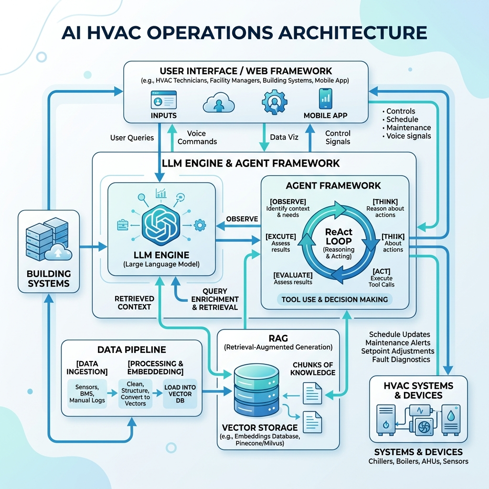
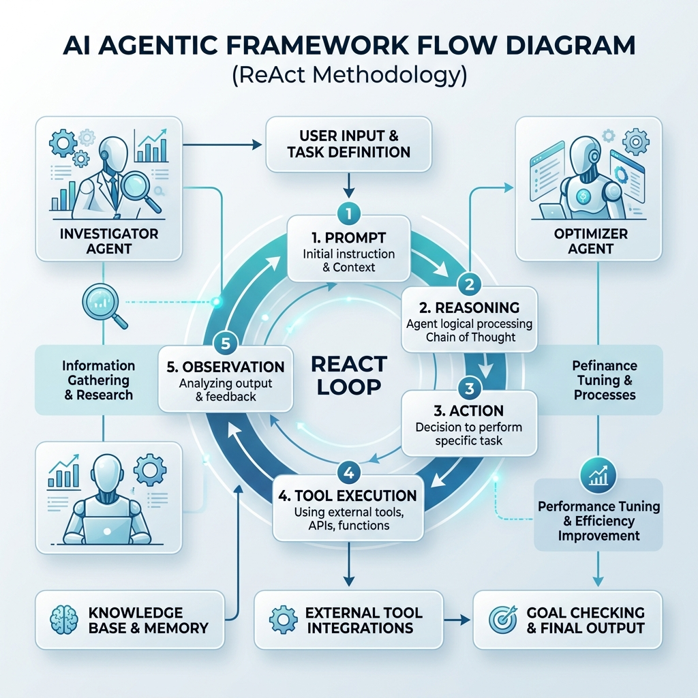

# AI Architecture & Orchestration Infographics

We have generated high-definition infographics for the platform's AI architecture and Agentic loops, and saved them directly into the project directory under `docs/architecture/`.

### 1. Overall AI Architecture Flow
This diagram illustrates the full stack including the FastAPI web framework, the LLM engine, and the RAG pipeline.

### 2. Specialized Agentic Framework (ReAct Loop)
This diagram zooms in specifically on the Agentic framework, illustrating the 8-step ReAct orchestration loop (Prompt → Reasoning → Action → Tool Execution → Observation) and the specialized agent personas.

*Note: These images have been saved to `docs/architecture/ai_architecture_flow.png` and `docs/architecture/ai_agentic_flow.png` respectively.*
